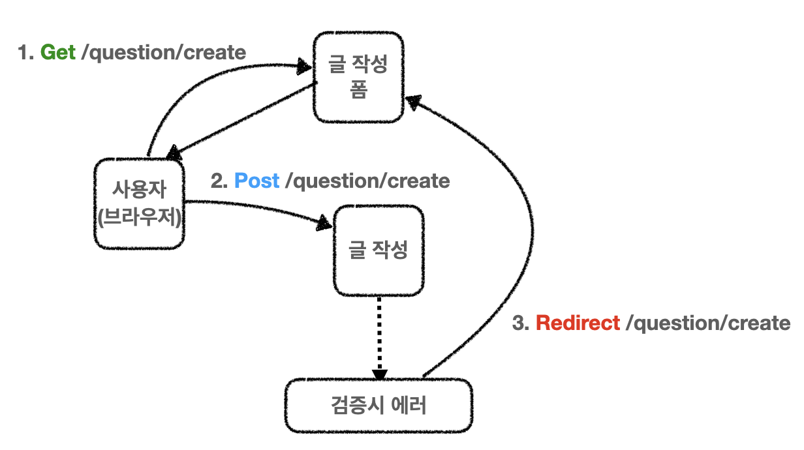
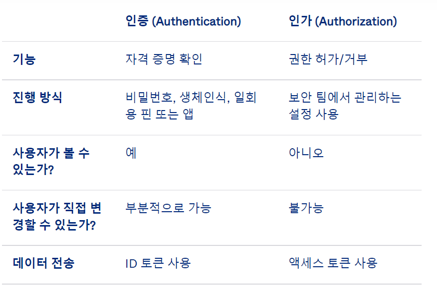
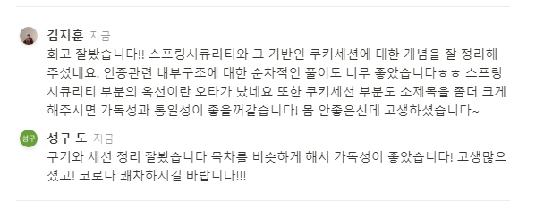
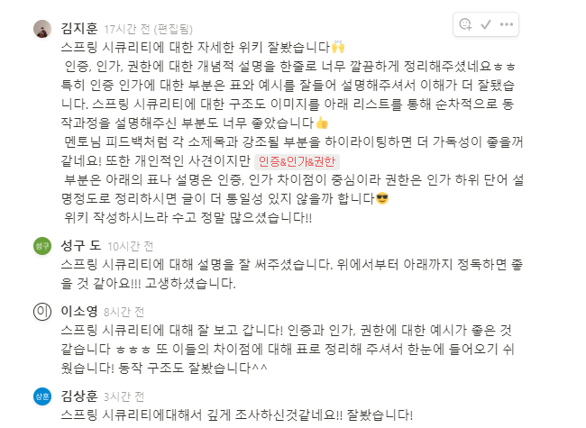
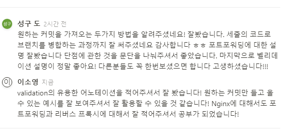
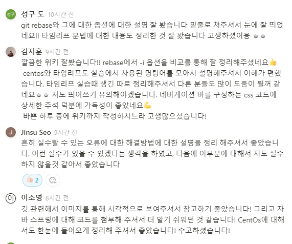

## **팀 구성원**

- [팀장] 김지훈, 도성구, 김상훈, 이소영 서진수

---

## **회고 내용 요약 (최소 500자 이상)**

팀원들과 함께 복습을 진행하면서 ‘기술적으로 새로 알게된 점, 어려웠던 점, 아쉬운 점' 등을 요약하여 작성해 주세요 🙂

### thymeleaf

📢 **th:each
th:each사용시⇒”item:${items}”
th:text⇒${}안의 값을 Value로 설정**

```html

<tr th:each="question : ${questionList}">
  <td th:text="${question.subject}"></td>
  <td th:text="${question.createDate}"></td>
</tr>
```

📢 **th:href
th:href사용시 ⇒@{} 필수**

```html
<a th:href="@{/question/list}"></a>
```

**th:href+${}사용시⇒| |로 문자열을 연결해줘야한다**

```html
<a th:href="@{|/question/detail/${question.id}|}"></a>
```

### 자주사용하는 thymeleaf

> **1) 분기문 속성**

분기문 속성은 다음과 같이 사용한다.
> 

```java
th:if="${question != null}"
// question 객체가 null이 아닌 경우 엘리먼트 표시
```

> **2) 반복문 속성**

반복문은 반복횟수만큼 해당 엘리먼트를 반복하여 표시한다. 
반복문 속성은 **자바의 for each 문과 유사하다.**
> 

```java
th:each="question : ${questionList}"

th:each="question, loop : ${questionList}"
//둘다 사용가능 
```

**loop 객체를 이용하여 루프내 다음과 같은 속성을 사용 할 수 있음**

- loop.index - 반복 순서, 0부터 1씩 증가
- loop.size - 반복 객체의 요소 갯수 (예: questionList의 요소 갯수)
- loop.first - 루프의 첫번째 순서인 경우 true
- loop.last - 루프의 마지막 순서인 경우 true
- loop.odd - 루프의 홀수번째 순서인 경우 true
- loop.even - 루프의 짝수번째 순서인 경우 true
- loop.current - 현재 대입된 객체 (예: 위의 경우 question과 동일)
- loop.count - 반복 순서, 1부터 1씩 증가

> 3**) 텍스트 속성**
`**th:text=값**` 속성은 해당 엘리먼트의 텍스트로 "값"을 출력한다.
> 

```java
th:text="${question.subject}"
```

텍스트는 `**th:text**`속성 대신에 다음처럼 대괄호를 사용하여 값을 직접 출력할수 있다.

```java
<tr th:each="question : ${questionList}">
    <td>[[${question.subject}]]</td>
    <td>[[${question.createDate}]]</td>
</tr>
```

- thymeleaf 관련 설명을 상훈님과 성구님의 회고에서 발췌해보았습니다.

### Validation

폼으로 값을 받아오는 경우가 웹사이트에선 거의 필수적으로 존재하는데 이럴 때마다 해당 값이 유효한지를 검사해줘야한다. 아래의 직접👀 그린 그림을 그런 수많은 경우 중에 글을 작성할 때 동작 과정을 간단하게 구조도처럼 그려봤다.

### Validation 동작 구조와 유용한 어노테이션



1. 사용자는 Get 메서드를 통해 글 작성 폼의 페이지를 요청한다.
    1. 서버는 글 작성 폼을 사용자에게 보여주며 응답한다.
2. 글 작성 폼을 받은 사용자는 변경될 내용을 폼에게 Post 메서드로 요청한다.
    1. **이때 사용자가 유효한 값(올바른 값)을 입력했는지 검증한다.**
3. 만일 검증시 에러가 발생하게 되면 Redirect로 폼으로 돌아가게 반환해준다.

이때 검증시 때 유용하게 사용할 수 있는게 **BindingResult** 클래스이다.

### BindingResult

BindingResult를 만일 쓰지 않았다면 아래와 같은 코드를 작성해야한다. Question 작성 폼에서 Subject와 Content를 받아오면 둘 다 null값은 아닌지, 해당 문자 길이가 얼마인지를 일일이 if문을 덕지덕지 써가며 검사를 해야할 것이다. 이는 펀하고 쿨하고 섹시하게 코딩하는 방식이 아니다.(개인적인 사견)

```java
		**@PostMapping("/create")
    public String questionCreate(Model model, QuestionFrom questionFrom) {
        if (questionFrom.getSubject() == null || questionFrom.getSubject().trim().length() == 0) {
            model.addAttribute("errorMsg", "제목 좀...");
            return "question_form";
        }

        if (questionFrom.getContent() == null || questionFrom.getContent().trim().length() == 0) {
            model.addAttribute("errorMsg", "내용 좀...");
            return "question_form";
        }

        questionService.create(questionFrom.getSubject(), questionFrom.getContent());
        return "redirect:/question/list"; // 질문 저장후 질문목록으로 이동**
```

BindingResult는 해당 에러들을 다 담은 바구니라고 생각하면 된다. 아래의 어노테이션들을 달아주게 되면 BindingResult에서 에러들을 판단하고 우리는 BindingResult에 에러가 있는지만 확인해주면 검증을 할 수 있다. 

```java
		**@PostMapping("/question/create")
    public String questionCreate(@Valid QuestionForm questionForm, BindingResult bindingResult) {
        // 만약 폼에서 받아온 데이터가 오류가 있다면?
        if (bindingResult.hasErrors()){
            return "question_form";
        }
        this.questionService.create(questionForm.getSubject(),questionForm.getContent());
        return "redirect:/question/list"; // 질문 저장후 질문목록으로 이동
    }**
```

Tip‼️

BindingResult 매개변수는 항상 @Valid 매개변수 바로 뒤에 위치해야 한다. 만약 2개의 매개변수의 위치가 정확하지 않다면 @Valid만 적용이 되어 입력값 검증 실패 시 400 오류가 발생한다.

### Validation의 유용한 어노테이션

](image/2.PNG)

출처: [https://wikidocs.net/161873](https://wikidocs.net/161873)

- Validation 정리를 지훈님이 정성스럽게 해주셔서 가져와 보았습니다.

### Spring Security

- Spring 기반의 **애플리케이션의 보안을 담당**하는 스프링 하위 프레임 워크
- 인증과 권한에 대한 부분을 **Filter 흐름에 따라 처리함.**
- 보안과 관련해서 체계적으로 많은 옵션을 제공해 주기 때문에 개발자 입장에서는 **일일이 보안관련 로직을 작성하지 않아도 되기 때문에 편리하다.**

### 인증&인가&권한 차이점

1. **인증(Authentication)** : 보호된 리소스에 접근한 대상에 대해 이 유저가 누구인지, 애플리케이션의 작업을 수행해도 되는 주체인지 확인하는 과정(ex. Form 기반 Login)
2. **인가(Authorize)** : 해당 리소스에 대해 접근 가능한 권한을 가지고 있는지 확인하는 과정 (After Authentication, 인증 이후)
3. **권한** : 어떠한 리소스에 대한 접근 제한, 모든 리소스는 접근 제어 권한이 걸려있다. 즉, 인가 과정에서해당 리소스에 대한 제한된 최소한의 권한을 가졌는지 확인한다.



Spring Security는 **세션-쿠키 방식으로 인증한다.**

1. 유저가 로그인을 시도함(http request)
2. AuthenticationFilter부터 userDB까지 들어감
3. DB에 있는 유저라면 UserDetails로 꺼내서 유저의 session생성
4. spring securigy의 인메모리 세션저장소인 SecurityContextHolder에 저장
5. 유저에게 session ID와 함께 응답을 줌
6. 이후 요청에서는 요청 쿠키에서 JSESSIONID를 확인해 유효하면 권한을 줌

- 스프링 시큐리티에 관한 내용은 진수님과 소영님께서 잘 정리해주셔서 가져와 보았습니다.

---

## **회고 과정에서 나왔던 질문 (최소 200자 이상)**

서로 피드백한 댓글을 첨부합니다.

### **이소영님 회고록**



### **서진수님 회고록**



### **김지훈님 회고록**



### **김상훈님 회고록**



### **도성구님 회고록**


---

## **회고 인증샷 & 팀 자랑**

- 필수) 팀원들과 함께 찍은 인증샷(온라인 만남시 스크린 캡쳐)도 함께 업로드 해주세요 🙂
- 이번주는 다같이 회의한 사진으로 대체합니다!!
    
    
    
- 필수) 자랑 멘트는 **‘팀 내에서 어떻게 복습을 하고 있고, 해당 복습 과정으로 인해 어떤 긍정적인 효과가 발생했는지’**에 대해 간단하게 작성해 주시면 됩니다 😊
    
    매일매일 스크럼을 진행하면서 오늘 진행했던 어려운 상황을 나누고 있습니다. 팀간 회고에서도 모르는 부분에 대해서 주 1회이상 꼭 음성채널에서 질문하는 시간을 갖고 있습니다🧐 서로 원활한 피드백으로 수업을 진행하면서 더 좋은 정보들을 공유하고 있습니다ㅎㅎ
    
    또한, 회고록에 변경점이나 개선사항을 댓글로 남겨서 진행하고 있는데 이로 인해 회고의 질을 높일 수 있어서 좋았습니다.
