## 팀 구성원

---

• [팀장] 김지훈, 도성구, 김상훈, 이소영 서진수

## 회고 내용 요약 (최소 500자 이상)

---

팀원들과 함께 복습을 진행하면서 ‘기술적으로 새로 알게된 점, 어려웠던 점, 아쉬운 점' 등을 요약하여 작성해 주세요 🙂
<details>
  <summary>지훈님 회고록</summary>
  <div markdown="1">

# 인프라

## Docker
---
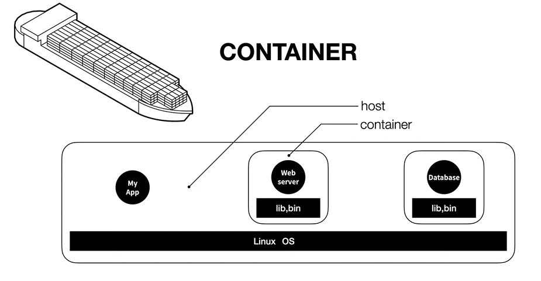
- 도커는 리눅스 위에서 동작한다.
- 컨테이너라는 독립된 공간은 리눅스가 가지는 특징이다.
- 사용자가 설정한 컨테이너를 관리하는 소프트웨어가 도커다.

### volume
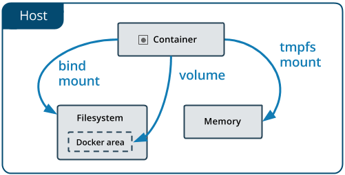
- 도커 컨테이너 안에 설치된 프로그램들은 컨테이너가 삭제되면 다같이 삭제된다.
- 이러한 프로그램들을 영속화시키기 위한 개념이 볼륨(volume)이다.


### 도커 이미지 파일 만들기
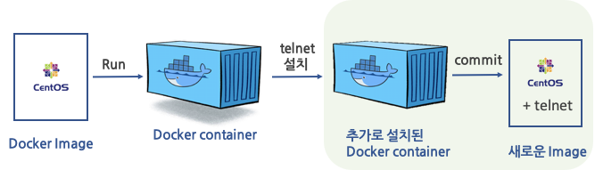
1. 기본이 되는 이미지를 만든다.
2. 도커를 실행시켜 기본 이미지를 컨테이너에 저장한다.
3. 새로운 환경에서 더 커스텀하여 새로운 이미지를 만들 수 있다.
### Dockerfile 제작

```docker
**# 최신 node 이미지로 부터 시작
FROM node

# Working Directory 지정
# 도커 컨테이너의 작업폴더를 지정
WORKDIR /usr/src/app

# COPY package.json ./
# 앞의 ./는 HOST OS의 현재 폴더를 의미
# 뒤의 ./는 컨테이너의 현재 폴더(WORKDIR)를 의미
# 즉 외부에서 만들어둔 package.json 파일을 컨테이너 내부로 복사하겠다는 의미
COPY ./ ./

# node의 종속성 다운로드
# RUN 명령어는 컨테이너에서 실행
RUN npm install

# 안해도 되지만, 하는게 좋습니다.
# 이 컨테이너는 8080 포트를 사용한다는 의미 입니다.
EXPOSE 8080

# docker run 명령에서 실행항 명령이, 이 명령어 부터는 제작타임이 아닌 런타임에서 실행됨
CMD ["node", "index.js"]**
```

### 참고할만한 자료

[Docker - Dockerfile 작성 / Build (이미지 제작)](https://blog.d0ngd0nge.xyz/docker-dockerfile-write/)

### express

- 노드를 만들어주는 웹서버 프레임워크이다.
- 자동으로 node.js, node mdule을 만들어준다.
  </div>
</details>


<details>
  <summary>상훈님 회고록</summary>
  <div markdown="1">

# linux-volume

- 이전 시간에 배웠던 exec 방식은 직접 컨테이너로 들어가서 bash 로 설정을해줬었는데
이제는 Host OS 에서 컨테이너 안에 작업을 해주싶음

### volume방식

```
//기존 컨테이너 삭제
docker rmi -f $(docker images -qa)

//도커 볼륨 폴더생성
sudo mkdir -p /docker_projects/nginx_1/volumes

//컨테이너 생성
//-p:포트지정
//-d:background로 실행
//--rm:삭제시 기록 완전삭제
docker run \
  --name=nginx_1 \
  -p 8031:80 \
  -v /docker_projects/nginx_1/volumes/usr/share/nginx/html:/usr/share/nginx/html \
  -d \
  --rm \
  nginx

//vim,mlocate,tree 설치
sudo yum install vim mlocate tree -y

// index.html 생성
echo "<h1>Hello, There</h1>" > /docker_projects/nginx_1/volumes/usr/share/nginx/html

```

### 이미지 제작하기위한 설정

```
//방화벽 끄기
sudo systemctl stop firewalld
sudo systemctl disable firewalld

//작업 프로젝트 폴더생성 및 이동
sudo mkdir -p /docker_projects/node_1/project
cd /docker_projects/node_1/project

```

```
//index.js 작성

vim index.js
//------------------------------------
const express = require("express");

const port = "8080";

const app = express();

app.get("/", (req, res) => {
  res.send("Hello Node");
});

app.listen(port);
console.log(`server running on ${port}`);
//------------------------------------
```

```
//nodejs 설치
sudo yum install nodejs -y

//express 설치
npm install express -> package.json 파일생성(각종 의존성에 대한 정보가 기술,
자바스크립트 버전의 build.gradle 파일)+ node_modeules 폴더생성됨(실제 라이브러리(express) 저장되는 폴더)

//실행
node index.js->8080포트로 실행!!

//크롬에서 실행
HostOs의ip:8080
```

### 도커 로 node 이미지생성

```
//dockerfile 생성
vim Dockerfile

# 최신 node 이미지로 부터 시작
FROM node

# Working Directory 지정
# 도커 컨테이너의 작업폴더를 지정
WORKDIR /usr/src/app

# COPY package.json ./
# 앞의 ./는 HOST OS의 현재 폴더를 의미
# 뒤의 ./는 컨테이너의 현재 폴더(WORKDIR)를 의미
# 즉 외부에서 만들어둔 package.json 파일을 컨테이너 내부로 복사하겠다는 의미
COPY ./ ./

# node의 종속성 다운로드
# RUN 명령어는 컨테이너에서 실행
RUN npm install

# 안해도 되지만, 하는게 좋습니다.
# 이 컨테이너는 8080 포트를 사용한다는 의미 입니다.
EXPOSE 8080

# docker run 명령에서 실행항 명령이, 이 명령어 부터는 제작타임이 아닌 런타임에서 실행됨
CMD ["node", "index.js"]
```

```
//토커 이미지 생성
docker build -t examhello .
//도커 이미지 확인
docker images

//도커 이미지 실행
docker run \
  --name=examhello_1 \
  -p 8080:8080 \
  --rm \
  -d \
  examhello

//docker 재시작
sudo systemctl restart docker

```

### 도커로 nginx이미지생성

```
//프로젝트 폴더로 이동
mkdir -p /docker_projects/nginxhello_1/project
cd /docker_projects/nginxhello_1/project

//index.html파일생성
vim index.html
<h1>Hello Nginx</h1>

//Dockerfile 생성
vim Dockerfile

FROM nginx

WORKDIR /usr/share/nginx/html

COPY ./ ./

EXPOSE 80

//도커이미지 생성
docker build -t nginxhello .
//도커 이미지 실행
docker run -d -p 8041:80 --name=nginxhello_1 --rm nginxhello

```

# SpringBoot-이미지 캐싱

- RestTemplate.getForObject→Rest Api 를 이용해서 자료 받기
- Tika→파일찾는 라이브러리

```java
public static String downloadImg(String url, String filePath) {
            new File(filePath).getParentFile().mkdirs();

            byte[] imageBytes = new RestTemplate().getForObject(url, byte[].class);
            try {
                Files.write(Paths.get(filePath), imageBytes);
            } catch (IOException e) {
                throw new RuntimeException(e);
            }

            String mimeType = null;
            try {
                mimeType = new Tika().detect(new File(filePath));
            } catch (IOException e) {
                throw new RuntimeException(e);
            }
            String ext = mimeType.replaceAll("image/", "");
            ext = ext.replaceAll("jpeg", "jpg");

            String newFilePath = filePath + "." + ext;

            new File(filePath).renameTo(new File(newFilePath));

            return newFilePath;
        }
```

---

- 로그인 유저 커스텀해서 추가정보넣기

```java
@Getter
public class MemberContext extends User {
    private final Long id;
    private final String profileImgUrl;

    public MemberContext(Member member, List<GrantedAuthority> authorities) {
        super(member.getUsername(), member.getPassword(), authorities);
        this.id = member.getId();
        this.profileImgUrl = member.getProfileImgUrl();
    }
}
```

- @AuthenticationPrincipal→커스텀한 로그인 정보 넘겨줄때 사용

```java
@GetMapping("/profile")
    public String memberProfile(@AuthenticationPrincipal MemberContext memberContext, Model model){
        model.addAttribute("memberContext", memberContext);
        return "/member/profile";
    }
```

- 커스텀한 로그인 정보 출력

```java
layout.html 에서 로그인 추가정보출력

        <div>아이디 : <span th:text="${memberContext.username}"></span></div>
        <div>아이디 : <span th:text="${memberContext.email}"></span></div>
```

---

- 이미지 주소대신 URL로 호출→단점:이미지 불러올때마다 호출 →SQL 1번씩 꼭사용

```java
@GetMapping("/profile/img/{id}")
    public String showProfileImg(@PathVariable Long id) {
				
        return "redirect:" + memberService.getMemberById(id).getProfileImgUrl();
					//==localhost:8080/image/경로/파일이름
    }
```

- 이미지 캐싱→계속 이미지 받아오지말고 한번 가져온거 재사용(만료 시간있음)

```java
@GetMapping("/profile/img/{id}")
    public ResponseEntity<Object> showProfileImg(@PathVariable Long id) throws URISyntaxException {
        URI redirectUri = new URI(memberService.getMemberById(id).getProfileImgUrl());
        HttpHeaders httpHeaders = new HttpHeaders();
        httpHeaders.setLocation(redirectUri);
        httpHeaders.setCacheControl(CacheControl.maxAge(60 * 60 * 1, TimeUnit.SECONDS));
        return new ResponseEntity<>(httpHeaders, HttpStatus.FOUND);
    }
```

  </div>
</details>


<details>
  <summary>진수님 회고록</summary>
  <div markdown="1">

**도커**

- 리눅스 재단이 발표한 ‘2014 가장 인기 있는 클라우드 오픈 소스’에서 2위를 차지한 도커는 리눅스 컨테이너 기술을 자동화해 쉽게 사용할 수 있게 하는 오픈소스 프로젝트

- 구글은 도커 기술을 활용한 새로운 오픈소스 프로젝트 ‘쿠베르네테스(Kubernetes)’를 시작했고 도커 기술을 엔터프라이즈로 가져오기 위해 노력 중

장점

- **쉽고 빠른 실행 환경 구축**

- **가볍고 빠른 실행 속도**

- **하드웨어 자원 절감**

- **공유 환경 제공**

- **쉬운 배포**

주의할 점 

- **개발 초기의 오버헤드**

- **리눅스(Linux) 친화적**

## 기존 아키텍처와 도커 아키텍처 비교
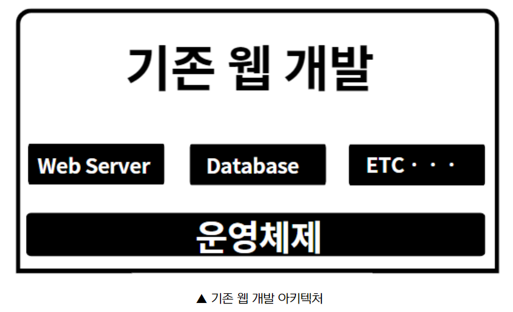
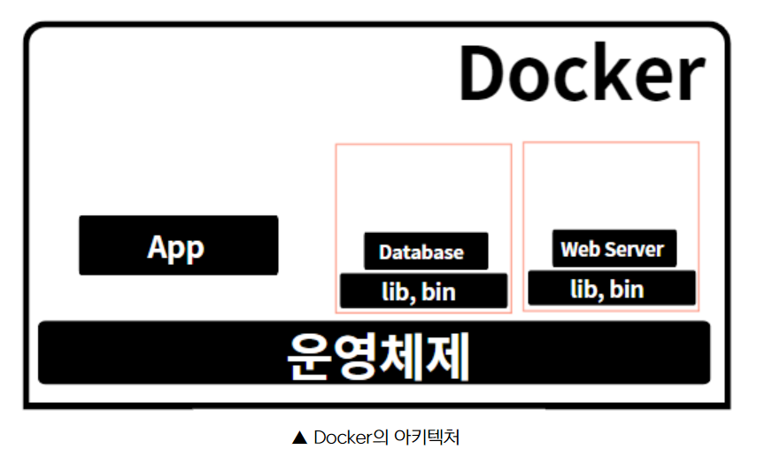
- 이렇게 개발환경이 다르기 때문에 생기는 불편함을 해소하기 위해 VMWare와 같은 가상머신(Virtual Machine)이 존재합니다.

- 가상 머신의 경우 컴퓨터 안에 가상의 컴퓨터 환경을 만들기 때문에 OS(운영체제)를 또 설치해야하는 부담이 있습니다. 그만큼 속도는 저하되고 리소스는 많이 사용하게 됩니다.

- 반면, **도커는 격리된 공간에 필요한 라이브러리, 실행파일만 담아놓고 사용하기 때문에 부담이 줄어듭니다.**

- 위 사진에서 가장 큰 틀을 **호스트(Host)** 라고 칭하고, DB나 Web Server를 담고 있는 빨간색 네모칸을 **컨테이너(Container)** 라고 칭합니다. 컨테이너 안에 담겨있는 프로그램들을 **이미지(Image)**
라고 합니다.

단축키

**컨테이너를 실행**

```
docker run [옵션] 이미지 [명령] // 컨테이너 실행
```

**이름을 정하는 옵션**

```
docker run --name 이름 이미지 // 컨테이너의 이름을 정해주고 실행
```

**컨테이너가 정상적으로 실행되었는지**

```
docker ps // 실행중인 컨테이너 확인
```

**실행중인 컨테이너를 정지**

```
docker stop [옵션] 컨테이너이름(아이디) // 실행중인 컨테이너 정지
```

**정지된 컨테이너를 확인**

```
docker ps -a // 정지된 컨테이너 확인
```

**정지된 컨테이너를 다시 실행**

```
docker start 컨테이너이름 // 정지된 컨테이너 재시작하기
```

**로그를 확인하는 것**

```
docker logs 컨테이너이름    // 실행중인 컨테이너 로그 확인하기
docker f- logs 컨테이너이름 // 계속 로그를 확인하고 싶을때 -f 옵션추가
```

**추적하고 싶다면 -f 옵션을 추가**

**컨테이너를 삭제**

```
docekr rm 컨테이너이름 // 컨테이너삭제
```

**컨테이너를 삭제하려면 먼저 stop 명령어를 통해서 컨테이너를 정지**

컨테이너가 아닌 **이미지를 삭제**

```
docekr rm 컨테이너이름 // 컨테이너삭제
```

출처

[도커 (naver.com)](https://terms.naver.com/entry.naver?docId=3586075&cid=59277&categoryId=59282)

[도커(Docker)의 장단점 및 주의점 - 5분전 (smileted.net)](https://smileted.net/docker-pros-cons/)

[[Docker] 도커(Docker)란? 도커의 개념, 장점, 구조 (tistory.com)](https://chanos.tistory.com/entry/Docker-%EB%8F%84%EC%BB%A4Docker%EB%9E%80-%EB%8F%84%EC%BB%A4%EC%9D%98-%EA%B0%9C%EB%85%90)
  </div>
</details>

<details>
  <summary>소영님 회고록</summary>
  <div markdown="1">

# 인프라

## 이미지와 컨테이너

- 프로그램(정적인 로직, 디스크) : 1
    
    프로세스(동적인 로직, 메모리) : N
    
- 이 때 이미지 == 프로그램, 컨테이너 == 프로세스라고 볼 수 있다.
- 즉, 이미지는 1개만 있어도 컨테이너로 여러개를 실행시킬 수 있다.

### 도커 이미지 명령어

- docker run hello-world <옵션>
    - 일단 현재 pc에 hello-world가 설치 되었는지 체크한 후 실행함
    - 옵션
        - -d :백그라운드에서 실행할 것
        - -p : 외부세상의 포트를 내부로 넣겠다.
        
- docker images
    - 현재 내 도커에 설치된 모든 이미지를 보여줌
- docker rmi <이미지명> <옵션>
    - rm은 지운다는 뜻 i는 이미지
    - 이미지를 지울 수 있다.
    - 단, 어딘가에 쓰이고 있거나 연결되어 있으면 지울수 없음 그럴 때는 -f 옵션을 지정함.
- docker pull 이미지명
    - 다운로드
    - 도커허브에서 이미지를 다운로드한다.
- 도커 초기화 스크립트
    
    ```java
    # 컨테이너 삭제
    docker rm -f $(docker ps -qa)
    
    # 이미지 삭제
    docker rmi -f $(docker images -qa)
    
    # 안쓰는 네트워크 삭제
    docker network prune -f
    
    # 안쓰는 볼륨 삭제
    docker volume prune -f
    
    # 도커 프로젝트 삭제
    sudo rm -rf /docker/projects
    sudo rm -rf /docker_projects
    ```
    

### 컨테이너 명령어

- docker ps
    - 현재 실행중인 컨테이너 목록
- docker ps -a
    - 현재까지 실행된 모든 기록 출력(종료된 컨테이너 포함)
- docker logs <컨테이너 아이디>
    - docker logs 7daa850a1d69
    - docker logs 7d
    - docker logs intelligent_faraday
    - 위는 모두 같은 의미임
- docker inspect | 옵션
    - 컨테이너 상태 대해 자세한 정보를 확인함
- docker rm -f <컨테이너 ID>
    - 컨테이너를 삭제함

### Docker로 nginx 실행하기

```java
//명령어 1단계
docker run nginx //ctrl+c 하면 nginx 가 꺼짐 + 외부에서 접근 불가
//명령어 2단계
docker run -d nginx //외부에서 접근 불가
//명령어 3단계
docker run -d -p 8031:80 nginx //문제점 없음
```

### 단순명령 & 상호작용 명령

- 단순명령
    - docker exec nginx_1 ls
    - docker exec nginx_1 apt-get update
- 상호작용 필요 명령
    - docker exec -it nginx_1 apt-get install vim
        - y 입력
        - 위 명령어 실행 전에 docker exec nginx_1 apt-get update 명령어 수행을 해야 함

### exec -it ID bash명령어로 컨테이너 내부에 진입해 파일 수정

```java
//컨테이너 내부 진입
docker exec -it ID bash
docker exec -it nginx_1 bash

//웹 루트 폴더로 이동
cd /usr/share/nginx/html

//리눅스 배포판 확인
cat /etc/issue
데비안 계열은 yum이 아닌 apt-get을 사용

//vim 설치
apt-get update
apt-get install vim -y

//수정할 파일에 대해 백업
cp index.html index.html.origin

//파일 수정
vim index.html
d 키 누르고 있기
a 키 여러번 눌러서 insert 모드로 변경
<h1>Hello World</h1> 입력
```

# Spring Boot

### 로그인 여부에 따른 페이지 접근 권한 작업

- sec:authorize="isAnonymous()”
    - 로그인 하지 않아도 접근 가능
- sec:authorize="isAuthenticated()”
    - 인증 되어야 접근 가능함

```java
		@PreAuthorize("isAnonymous()")
    @GetMapping("/join")
    public String showJoin() {
        return "member/join";
    }

    @PreAuthorize("isAnonymous()")
    @GetMapping("/login")
    public String showLogin() {
        return "member/login";
    }

    @PreAuthorize("isAnonymous()")
    @PostMapping("/join")
    public String join(HttpServletRequest req, String username, String password, String email, MultipartFile profileImg) {
        Member oldMember = memberService.getMemberByUsername(username);
```

```java
<a href="/member/login" sec:authorize="isAnonymous()">로그인</a>
<a href="/member/join" sec:authorize="isAnonymous()">회원가입</a>
<a href="/member/logout" sec:authorize="isAuthenticated()">로그아웃</a>
<a href="/member/profile" sec:authorize="isAuthenticated()">프로파일</a>
```

- 로그인과 회원 가입은 누구든지 접근가능하므 sec:authorize="isAnonymous()” 사용
- 로그아웃과 프로파일은 로그인을 해 인증을 받아야 하므로sec:authorize="isAuthenticated()” 사용

### 저장되는 파일의 확장자 유지, 저장 폴더 날짜로 세분화

```java
String profileImgDirName = "member/" + Util.date.getCurrentDateFormatted("yyyy_MM_dd");

String ext = Util.file.getExt(profileImg.getOriginalFilename());

String fileName = UUID.randomUUID() + "." + ext;
```

### 프로필 이미지 등록

```java
Member member1 = memberService.join("user1", password, "user1@test.com");
memberService.setProfileImgByUrl(member1, "https://picsum.photos/200/300");

Member member2 = memberService.join("user2", password, "user2@test.com");
memberService.setProfileImgByUrl(member2, "https://picsum.photos/200/300");
```

```java
public void setProfileImgByUrl(Member member, String url) {
        String filePath = Util.file.downloadImg(url, genFileDirPath + "/" + getCurrentProfileImgDirName() + "/" + UUID.randomUUID());
        member.setProfileImg(getCurrentProfileImgDirName() + "/" + new File(filePath).getName());
        memberRepository.save(member);
    }
```

  </div>
</details>

<details>
  <summary>성구님 회고록</summary>
  <div markdown="1">

### 도커

***7강 부터~~ 22강까지***

[위캔 | Ken 10274](https://wiken.io/ken/10274)
---

- 프로그램과 프로세스

1) 프로그램 (정적인 로직, 디스크) : 1

2) 프로세스(동적인 로직, 메모리) : N  

지뢰찾기 : 1번설치

지뢰찾기 실행을 동시에 : N개 실행  

도커에서도 똑같은 개념

**프로그램 == 이미지**

**프로세스 == 컨테이너**  

- docker run hello-world

-일단 현재 내 PC에 hello-world 가 설치되어 있는지 체크

- **도커 명령어**

```bash
docker run hello-world

조회 1)
docker ps
- 현재 실행중인
조회 2)
docker ps -a
- 모든 기록을 출력

# 이미지(프로그램)
다운로드
docker pull 이미지명
삭제
docker rmi -f 이미지명
목록
docker images

# 컨테이너(프로세스)
컨테이너 조회 (현재 실행중)
- docker ps
컨테이너 전체조회 (모든 기록 출력)
- docker ps -a

# 컨테이너 단건 로그보기
- docker logs ID

컨테이너 ID와 이름은 고유합니다.
아래 명령어 3개는 전부 같은 의미 입니다.
docker logs -> 내부적으로 쌓아뒀던 로그들을 보여준다.

docker logs 7daa850a1d69
docker logs 7d
docker logs intelligent_faraday

# 자세히 보기
docker inspect ID
마우스휠로 왔다갔다 하면서 볼 수 있음.
docker inspect [ps에서 조회한] | less 

# 컨테이너 삭제
docker rm -f ID
실행중인 경우 -> 중지 후 삭제
이미 종료된 프로세스 -> 기록삭제

# 전부삭제
docker rm -f $(docker ps -qa)
```

컨테이너 삭제  -
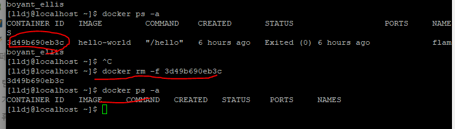
tip. 

`ls, cd` : 단발성 (바로 실행하고 꺼지는 프로세스)  
`sudo systemctl start nginx` : 데몬(백그라운드 프로세스, 끄기전까지 영속적)

- **도커허브에서 이미지 다운로드 후 삭제, 3개 이상**
    - 도커계의 앱스토어
    - docker pull 이미지명
    - 이렇게 하면 도커허브에서 이미지를 다운로드 한다.
        
        [Docker Hub Container Image Library | App Containerization](https://hub.docker.com/)
        

- **도커와 nginx  명령어 정리**

```bash
# docker run nignx
/* 문제점
1) Ctrl + C를 하면 nginx가 꺼진다.
2) 외부에서 접근할 방법이 없다.
원래 도커 컨테이너는 독립적인 공간에서 실행되기 때문에 
접근이 안되는게 정상이다. 

# docker run -d nginx
문제점
백그라운드로 실행
외부에서 접근할 방법이 없다.

# docker run -d -p 8031:80 nginx
포트옵션 바깥세상에 있는 8031:80에 연결하겠다 (포트포워딩)
문제점 - 없음

# http://192.168.56.109:8031/
크롬에서 확인

도커 컨테이너에 이름부여, 종료시 자동 삭제 설정까지 부여
실행
docker run -d -p 8031:80 --name=nginx_1 --rm nginx
종료
docker stop nginx_1

exec 로 단순명령을 컨테이너에 전달, 
exec -it 로 상호작용필요명령을 컨테이너에 전달

# 단순명령
docker exec ID 명령어
docker exec nginx_1 ls
docker exec nginx_1 apt-get update

# 상호작용필요명령
docker exec -it ID 명령어
docker exec -it nginx_1 apt-get install vim

# nginx(os)로 들어가기
docker exec -it nginx_1 bash
```

- ***nginx (OS) 에게 ls 하는 방법***

기본적으로 명령어 ls를 입력하게 되면 CentOS 현재 디렉토리에 ls 가 된다

그럼 도커 안에 있는 nginx (OS)에 ls 명령은 어떻게 할까?
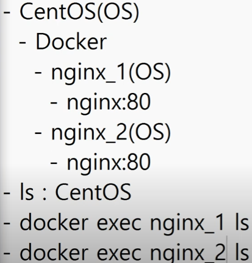

→ **docker exec nginx_1 ls**

tip.

**nginx 컨테이너는 외부와 격리되어 있는데,** 

**외부 크롬으로 접근할 수 있는 이유는 
run 명령어에 포트포워딩 옵션을 추가해서 가능하다.**

- **exec -it ID bash 명령어로 컨테이너 내부에 진입하여
index.html 파일 수정**  

<aside>
✅ 1) 내부 진입

`docker exec -it ID bash`

`docker exec -it nginx_1 bash`  

2) ****웹 루트 폴더로 이동****

`cd /usr/share/nginx/html`  

3) ****리눅스 배포판 확인****

`cat /etc/issue`

데비안 계열은 yum이 아닌 apt-get을 사용함  

4) ****vim 설치****

`apt-get update`

`apt-get install vim -y`  

5) ****수정할 파일에 대해서 백업****

`cp index.html index.html.origin`  

6) ****파일 수정****
`vim index.html`

d 키 누르고 있기  
a 키 여러번 눌러서 insert 모드로 변경  
`<h1>Hello World</h1>` 입력  

7) **크롬에서 확인**

****`http://192.168.56.109:8031/`****

</aside>


---


### 스프링 시큐리티

참고자료 : 

[15. Expression-Based Access Control](https://docs.spring.io/spring-security/site/docs/3.0.x/reference/el-access.html#el-common-built-in)

블로그 글의 원문이지 않을까 싶다.

프로젝트와 수업에서 @PreAuthorize, @PostAuthorize 어노테이션을 다뤘고 

mypage에 인가된? 현재 로그인된 사용자만 접근할 수 있도록 하기 위해 여러가지 자료를 찾아보았는데.

참고자료를 공부하신분들 중에 쉽게 풀어놓은 자료가 있어서 참고했다.

[Spring Security Annotation](https://m.blog.naver.com/PostView.naver?isHttpsRedirect=true&blogId=opzyra&logNo=221510214795)

일단 두가지 어노테이션의 특징으로는

> @PreAuthorize 해당 **로직을 수행 후 권한을 검사**
> 
> 
> @PostAuthorize 해당 **로직을 수행하기 전에 권한을 검사**
> 

그리고 `@Secured("ROLE_ADMIN")` 과 같은 어노테이션을 사용하면 

특정 **권한(예시는 관리자)만 접근이 가능한 컨트롤러도 구현할 수 있다.**

이외에도 아래와 같은 여러가지 **시큐리티 어노테이션 옵션**을 사용할 수 있다.


<aside>
✅ hasRole([role]) : 현재 사용자의 권한이 파라미터의 권한과 동일한 경우 true

hasAnyRole([role1,role2]) : 현재 사용자의 권한디 파라미터의 권한 중 일치하는 것이 있는 경우 true

principal : 사용자를 증명하는 주요객체(User)를 직접 접근할 수 있다.

authentication : SecurityContext에 있는 authentication 객체에 접근 할 수 있다.

permitAll : 모든 접근 허용

denyAll : 모든 접근 비허용

isAnonymous() : 현재 사용자가 익명(비로그인)인 상태인 경우 true

isRememberMe() : 현재 사용자가 RememberMe 사용자라면 true

isAuthenticated() : 현재 사용자가 익명이 아니라면 (로그인 상태라면) true

isFullyAuthenticated() : 현재 사용자가 익명이거나 RememberMe 사용자가 아니라면 true

</aside>


프로젝트에 RememberMe가 적용될 예정이라고 하니 이 부분도 고려해야할 것 같고 
현재 어노테이션(`isAuthenticated()`) 로그인 상태이면 접근이 가능하지만 
다른 로그인 된 사용자? 가 접근하면 어떡할지는 좀 더 알아보아야 할 것 같다.


---

아래와 같이 user.name을 검사해서 현재 로그인된 사용자와 비교하는 것도 가능함을 알았다.  적용이 되는지는 코드를 수정해서 해보도록 하자.

(hasRol은 권한)

```java
//로그인상태 and nser.name과 로그인정보 비교 or 관리자만 접근 가능하게 함.
@PreAuthorize("isAuthenticated() and (( #siteuser.username == [principal.name](http://principal.name/) ) or hasRole('ROLE_ADMIN'))")
```

참고자료 : 

[Spring Security @PreAuthorize, @PostAuthorize 를 사용하는 신박한 전처리 후처리 기법](https://blog.thereis.xyz/21)

[Spring Security Annotation](https://m.blog.naver.com/PostView.naver?isHttpsRedirect=true&blogId=opzyra&logNo=221510214795)

[SpringSecurity(AccessDenied) 인증거부처리](https://anjoliena.tistory.com/108)

권한관련
  </div>
</details>

## 회고 과정에서 나왔던 질문 (최소 200자 이상)

---

**서로 피드백한 댓글을 첨부합니다.**

### 지훈님 회고록 피드백
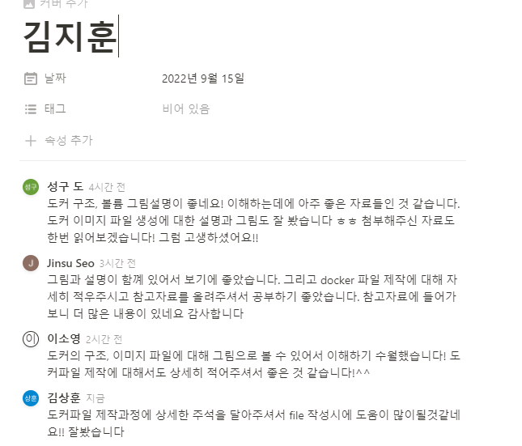
### 상훈님 회고록 피드백
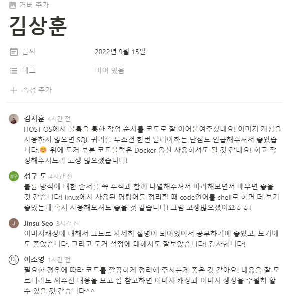
### 진수님 회고록 피드백
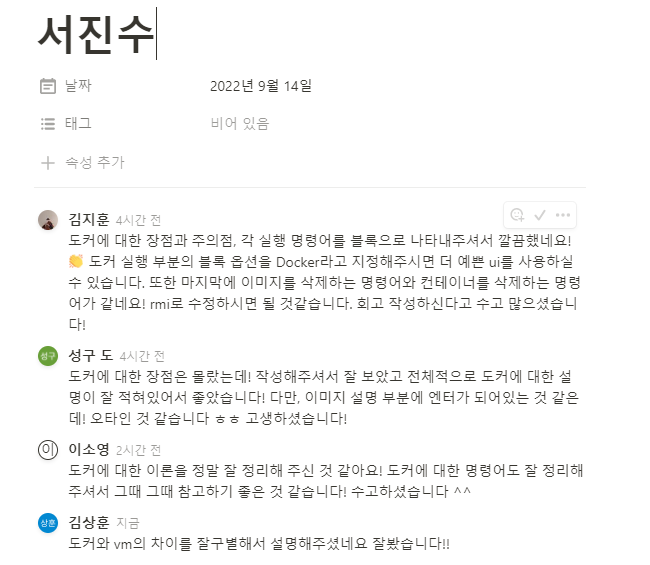
### 소영님 회고록 피드백
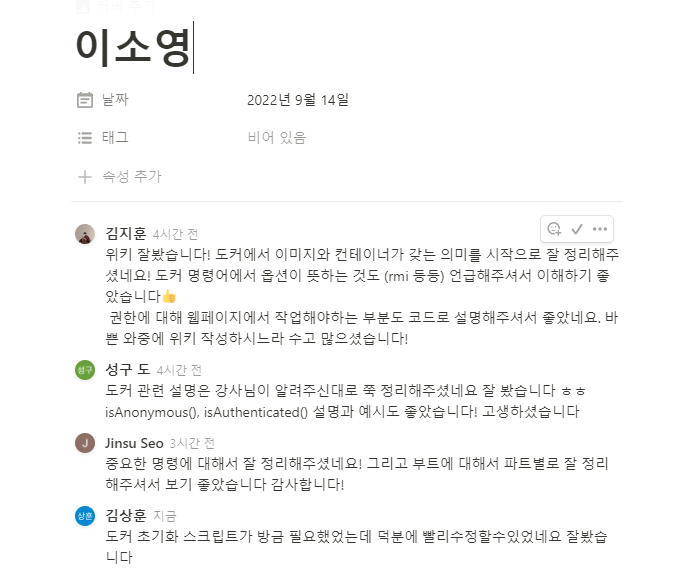
### 성구님 회고록 피드백
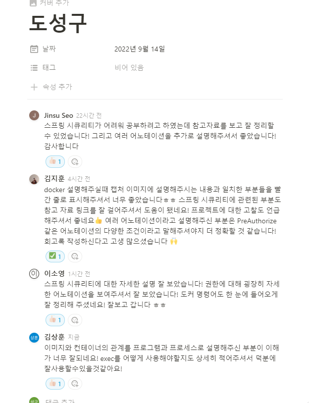
## 회고 인증샷 & 팀 자랑

---

### 필수) 팀원들과 함께 찍은 인증샷(온라인 만남시 스크린 캡쳐)도 함께 업로드 해주세요 🙂
 
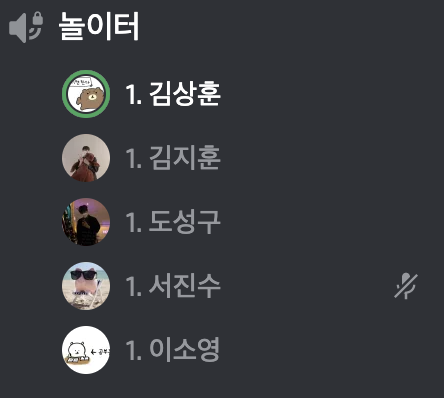

### 필수) 자랑 멘트는 ‘팀 내에서 어떻게 복습을 하고 있고, 해당 복습 과정으로 인해 어떤 긍정적인 효과가 발생했는지’에 대해 간단하게 작성해 주시면 됩니다 😊


- 현재 한 주당 1회 회고를 필수로 작성하고 있는데 이 회고를 다른 팀원들이 읽고 댓글을 자유롭게 남기는 형태로 진행하고 있습니다! 📝
- 팀원들의 회고는 하루동안 혹은 중요한 부분을 기술하고 있으며, 팀원들의 댓글은 피드백과 배운 점을 남김으로써 
서로서로 **공부하고 있는 내용이나 강의에 대한 정확한 이해를 돕는 점이** 
가장 큰 효과로 작용하고 있습니다. 😁